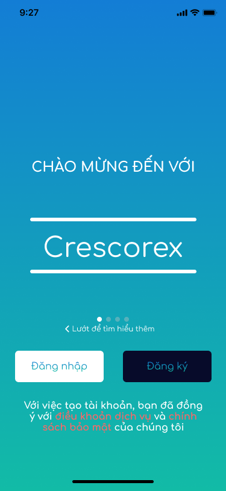
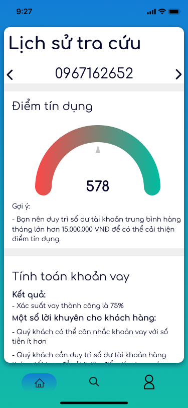

# NERDHERD's CRESCOREX

NerdHerd's frontend source code for DevC Challenge's graduation project. 

<table width="80%" align="center" style="border: 0px solid white">
  <tr>
    <td align="center">
      
    </td>
    <td align="center">
      
    </td>
    </tr>
</table>

## TEAM MEMBERS

Team members: 
- [Ngô Tài Phát](https://github.com/PhatsNgoo): Project manager; Designer
- [Hoàng Minh Tú](https://github.com/mnhthng-thms): Backend developer; Frontend developer
- [Đỗ Trung Đức](https://github.com/duc1807): Frontend developer
- [Nguyễn Minh Quân](https://github.com/minhquanym): Data scientist
- [Lê Vũ Quang](https://github.com/vuquang23): Data scientist

## FEATURES

For Bank Staff: 

- [x] Login, logout
- [x] Send OTP confirmation message to customer's phone number
- [x] Query credit score of bank's personal customer
- [x] History of search queries
- [x] Internalisation: Vietnamese and English languages

## CHANGELOG

See [CHANGELOG](https://github.com/mnhthng-thms/NerdHerd-Final-Project-frontend/blob/master/CHANGELOG.md)

